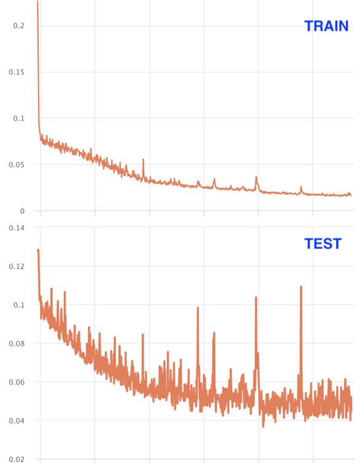
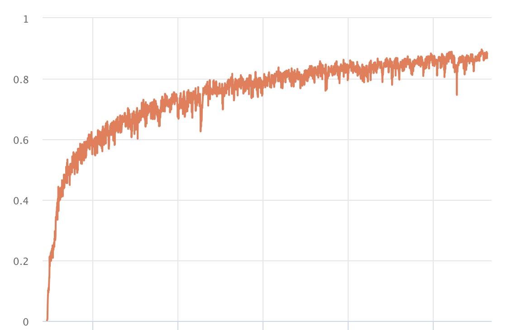
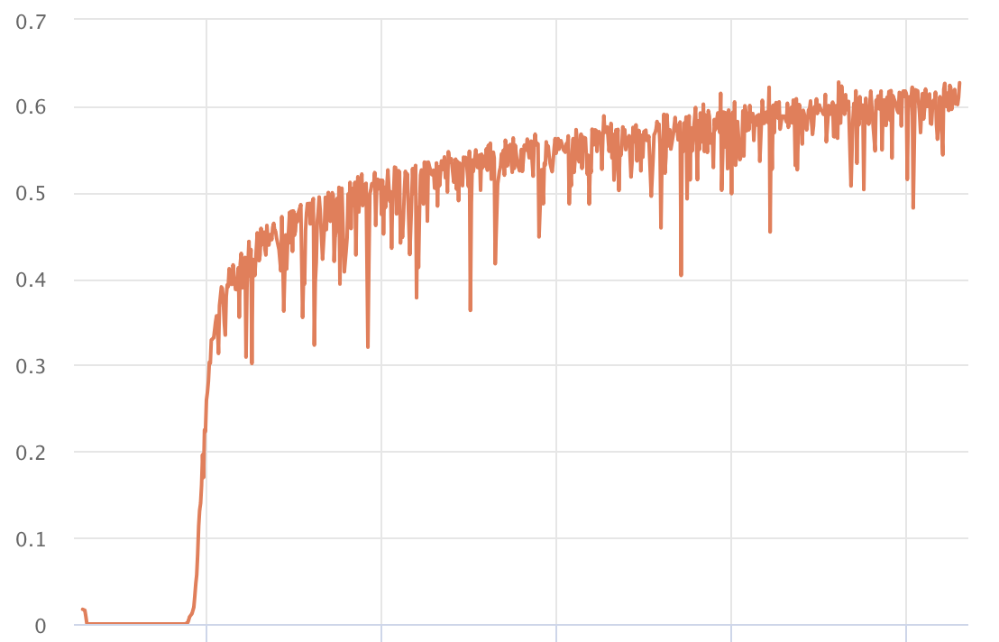
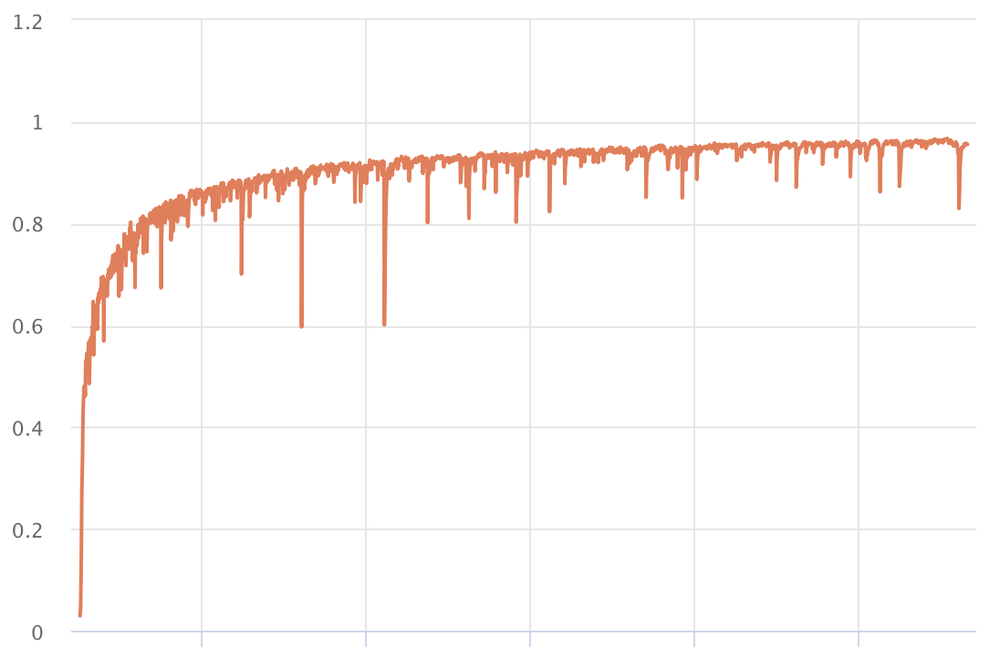
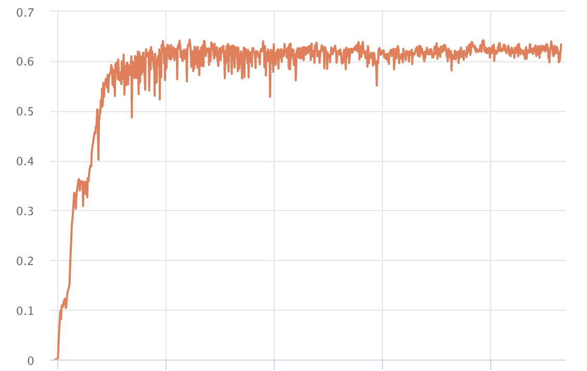

## Learning Curves

Gallery of learning curves of training and validation. You will notice many interesting features from these curves. 

Keep this gallery for daily check for inspirations.

## Train and valid

## Train

## Valid

----
### More
[https://lossfunctions.tumblr.com/](https://lossfunctions.tumblr.com/) There is a website for learning curves contributed from other peoples. But it have not been updated for a while.