## Learning Curves

Gallery of learning curves of training and validation. You will notice many interesting features from these curves. 

Keep this gallery and check daily for inspirations.

## Train and valid

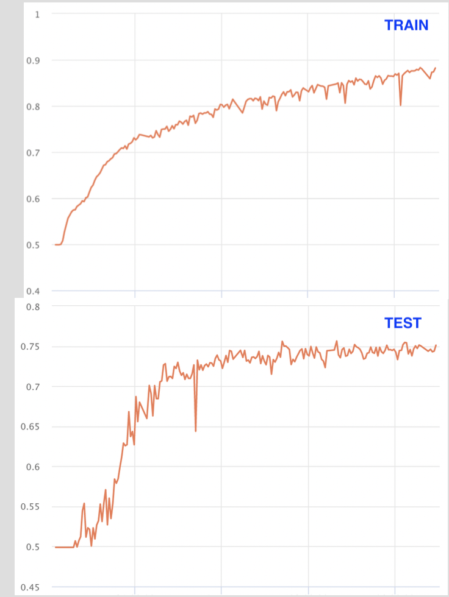
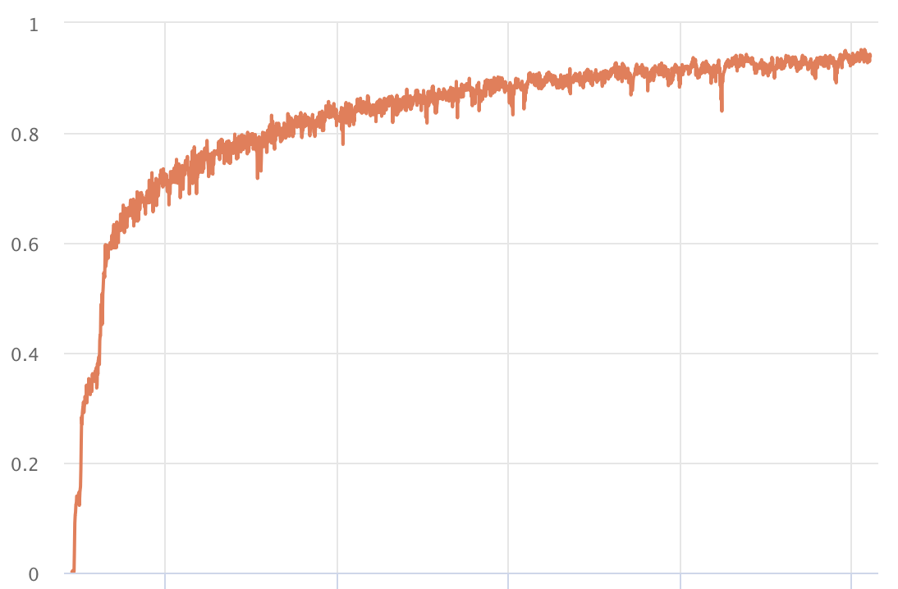
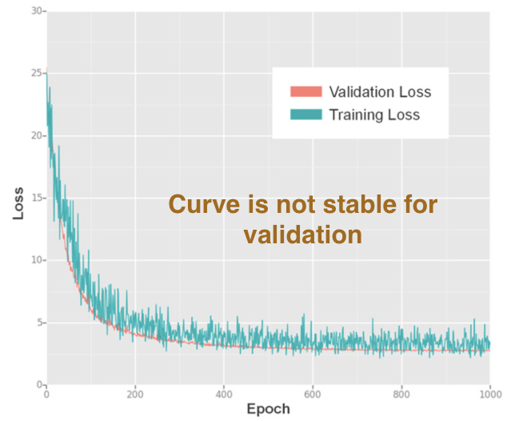
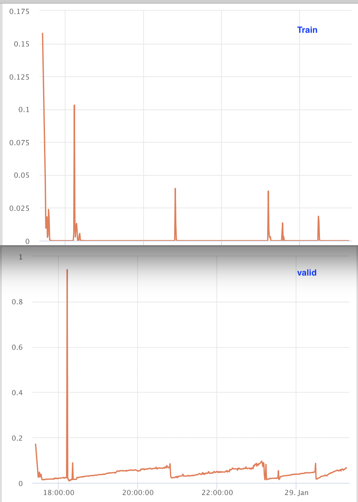

##Train

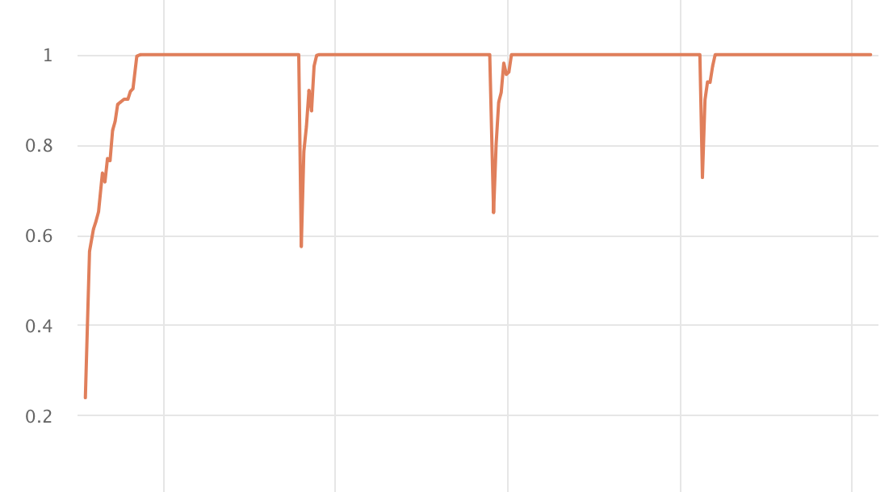
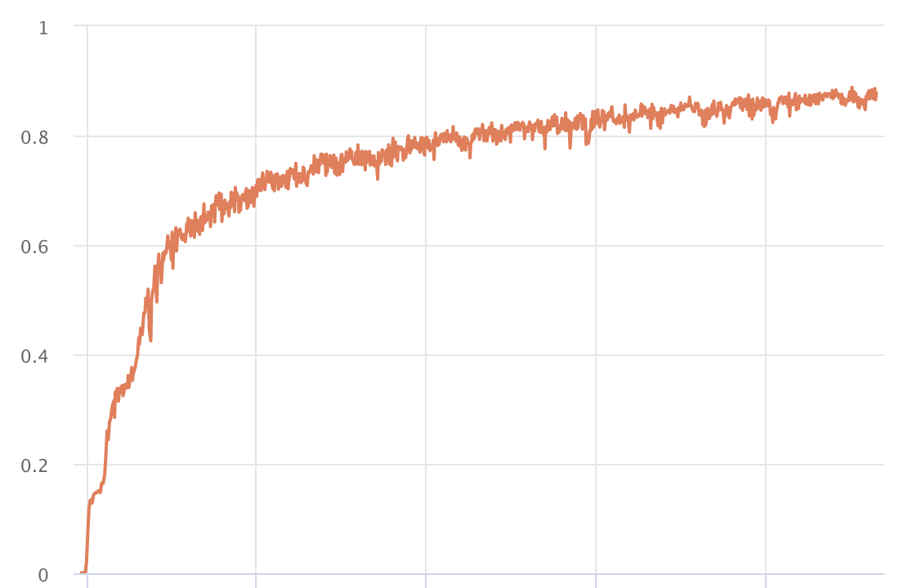
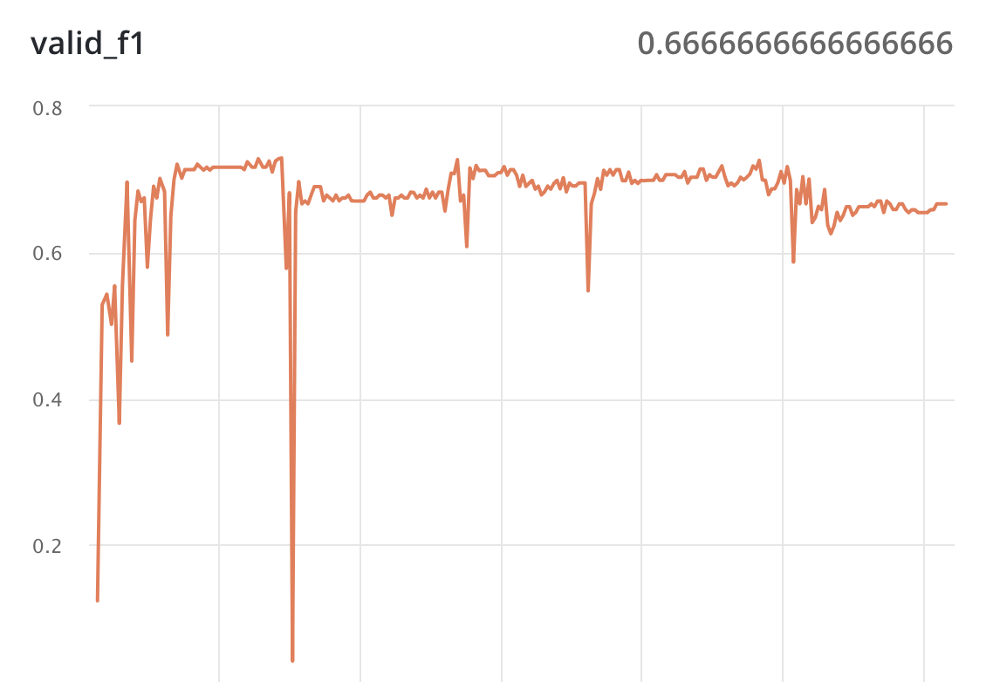
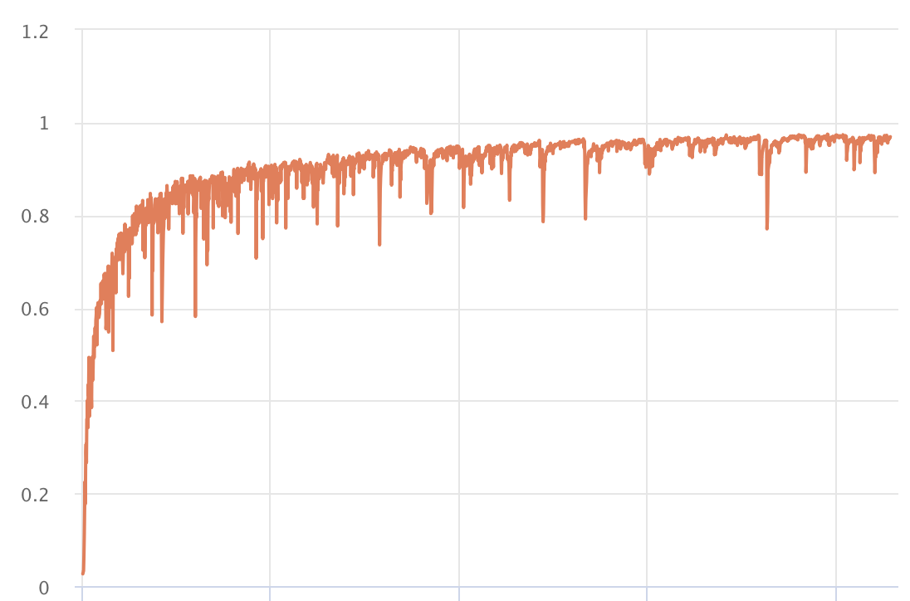

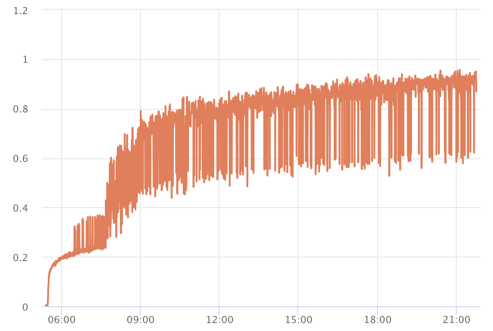

##Valid

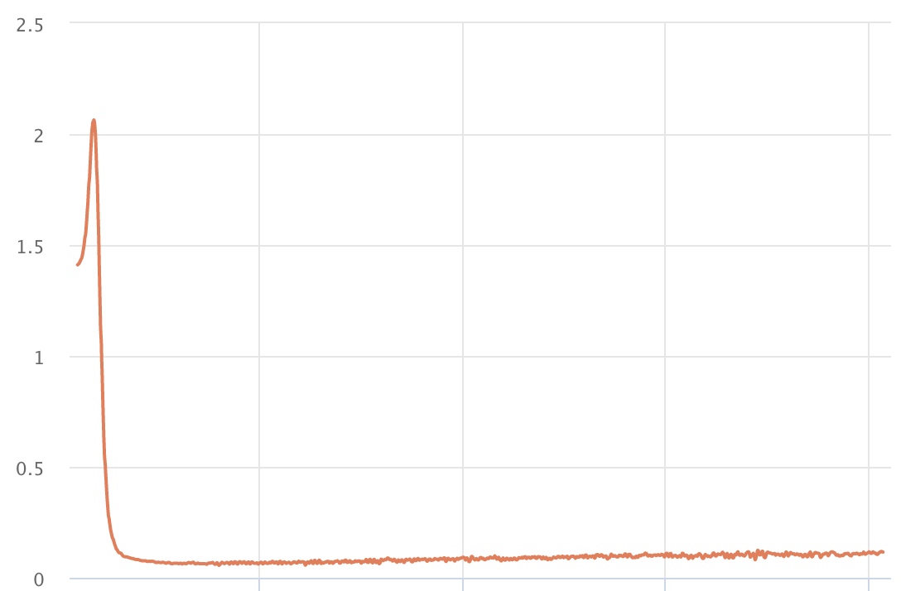
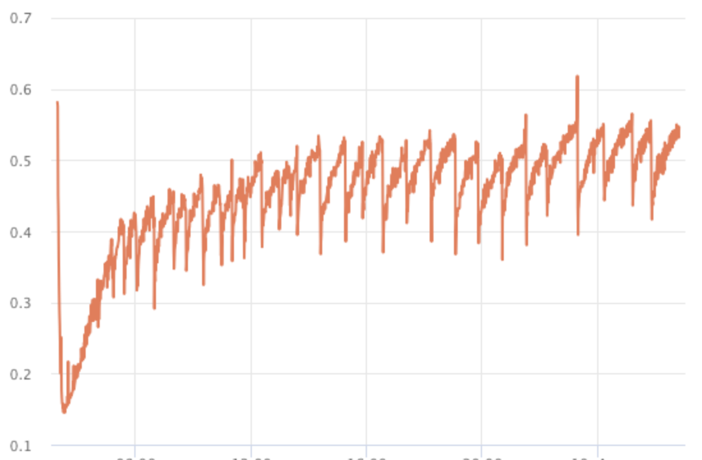

----
### More
[https://lossfunctions.tumblr.com/](https://lossfunctions.tumblr.com/) There is a website for learning curves contributed from other peoples. But it have not been updated for a while.